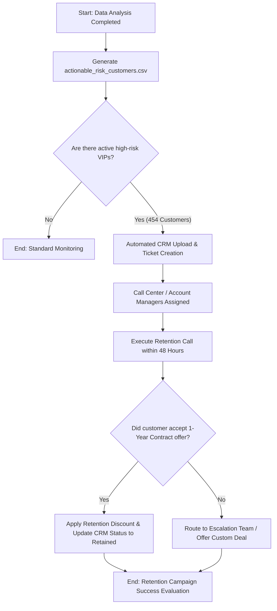

# Customer Retention Operation Process (BPMN Workflow)

This document defines the automated corporate workflow triggered after the data analysis identifies high-risk VIP customers. The goal is to proactively retain the **454 high-risk VIP customers** identified in Step 6 of our data analysis.

---

## 1. Process Flowchart (Mermaid)

This diagram shows how the data flows from our automated Python script directly to the customer relations and marketing teams.

---

## 2. Detailed Process Steps

### Step 1: Data Trigger & ETL Pipeline

* **Actor:** Automated Python Script (`business_analysis.ipynb`)
* **Action:** The script runs weekly, updates the `TotalCharges` format, filters the dataset for active Month-to-month customers with high bills and low tenure (tenure $\le 18$ months), and exports `actionable_risk_customers.csv`.

### Step 2: Customer Care Assignment (CRM Ingestion)

* **Actor:** CRM Administrator / Automated Integration
* **Action:** The exported CSV file is automatically ingested into the company's CRM system. Support tickets are generated for the 454 high-risk users, flagging them as "VIP Churn Risk".

### Step 3: Retention Call Execution

* **Actor:** Dedicated Customer Retention Specialists
* **Action:** Agents must contact the assigned high-risk customers within 48 hours.
* **The Pitch:** Since these customers pay above-average monthly charges on short-term contracts, agents will offer a 15% discount tied to a 1-Year Fixed Contract to secure long-term loyalty.

### Step 4: Outcome Resolution & Logging

* **Scenario A (Success):** Customer accepts the contract. The agent updates the CRM, lock-in period is set to 12 months, and the financial impact is updated.
* **Scenario B (Escalation):** Customer rejects or complains about pricing/tech issues. The ticket escalates to senior account managers for custom data-plan negotiations.

---

## 3. Business Key Performance Indicators (KPIs)

To measure the success of this workflow, the management team will track the following metrics monthly:

| KPI Metric | Target Goal | Formula / Calculation |
| --- | --- | --- |
| **Retention Success Rate** | $> 70\%$ | $(\text{Retained Customers} / 454) \times 100$ |
| **SLA Compliance** | $95\%$ | Calls made within 48 hours of CSV generation |
| **MRR Saved** | $> \$20,000$ | Monthly Revenue kept from successfully converted VIPs |